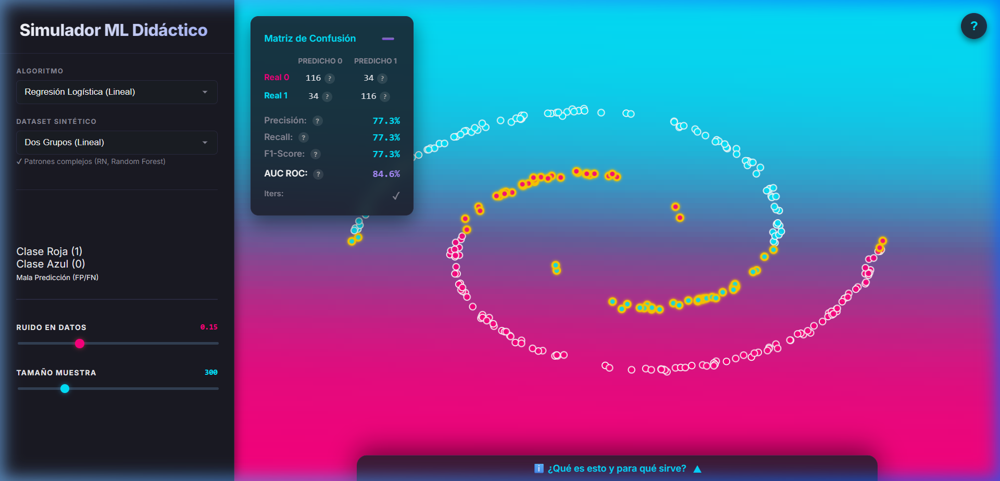

# Simulador ML Didáctico 🧠

Una herramienta web interactiva para aprender, visualizar y experimentar con algoritmos clásicos de Machine Learning en el navegador.

Este proyecto permite a los usuarios inyectar puntos de datos en tiempo real sobre un lienzo 2D y observar al instante cómo reacciona la frontera de decisión (Decision Boundary) de diferentes algoritmos de predicción, funcionando como una excelente herramienta pedagógica para entender el comportamiento espacial de la Inteligencia Artificial.

🚀 **¡Pruébalo ahora en el Demo en Vivo!** [https://simuladorml.ofazzito.com.ar/](https://simuladorml.ofazzito.com.ar/)



## Características

- 🏗️ **Back-end en Python (FastAPI):** Entrenamiento de algoritmos pesados de Scikit-learn delegados al backend para mantener el rendimiento al máximo.
- 🎨 **Front-end Responsivo e Interactivo:** Una UI pulida apta tanto para navegadores de escritorio como dispositivos móviles.
- 🖱️ **Inyección de Puntos Customizados:**
  - **Clic Izquierdo:** Añade un punto de Clase 1 (Rojo).
  - **Clic Derecho / Largo:** Añade un punto de Clase 0 (Azul).
- 🧑‍🏫 **Enciclopedia Algorítmica:** Incluye explicaciones didácticas en vivo, casos de uso del mundo real, ventajas y desventajas del algoritmo seleccionado en cada momento.
- ⚙️ **8 Algoritmos de Machine Learning Incorporados:**
  - Regresión Logística (Lineal)
  - K-Nearest Neighbors (KNN)
  - Árbol de Decisión
  - Random Forest
  - Máquinas de Vectores de Soporte (SVM)
  - Red Neuronal (Multicapa - Perceptrón)
  - Naive Bayes (Gaussiano)
  - Gradient Boosting

## Estructura del Proyecto

* `main.py`: Punto de entrada de la API REST usando FastAPI. Implementa el entrenamiento del modelo y devuelve la frontera espacial y las métricas.
* `index.html`: La Interfaz de Usuario. Una SPA (Single Page Application) que dibuja SVG y contiene todos los sliders de manipulación y menús.
* `requirements.txt`: Dependencias de Python necesarias.
* `Dockerfile` / `.dockerignore`: Preparado para su rápido despliegue en contenedores (Ej: vía Coolify, Docker Compose o VPS).

## Instalación y Ejecución Local

Para correr esto en tu computadora necesitas tener **Python 3.9+** instalado.

1. Clona el repositorio:
   ```bash
   git clone https://github.com/ofazzito/simulador-ml.git
   cd simulador-ml
   ```

2. (Opcional pero Recomendado) Crea un entorno virtual:
   ```bash
   python -m venv .venv
   # Windows:
   .venv\Scripts\activate
   # Linux/Mac:
   source .venv/bin/activate
   ```

3. Instala los requerimientos de Scikit-Learn y Uvicorn:
   ```bash
   pip install -r requirements.txt
   ```

4. Lanza el servidor de desarrollo:
   ```bash
   uvicorn main:app --reload
   ```

5. Ahora abre tu navegador web favorito y entra a: http://127.0.0.1:8000. ¡El Simulador cargará automáticamente!

## Despliegue en Producción (Docker)

Este proyecto incluye un `Dockerfile` optimizado. Para desplegarlo usando Docker:

1. Construye la imagen localmente:
   ```bash
   docker build -t simulador-ml .
   ```

2. Ejecuta el contenedor exponiendo el puerto al exterior:
   ```bash
   docker run -d -p 8000:8000 simulador-ml
   ```

---
**Creado por [Omar Fazzito](https://ofazzito.com.ar)** - Democratizando la IA paso a paso.
